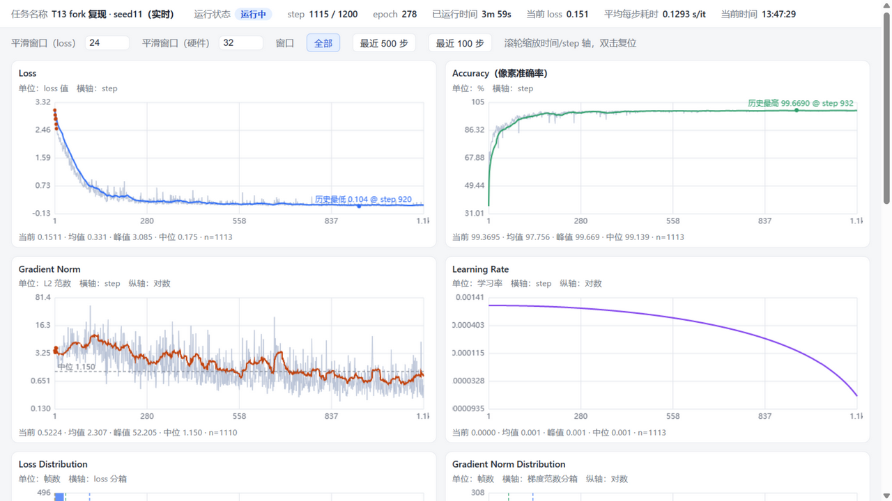
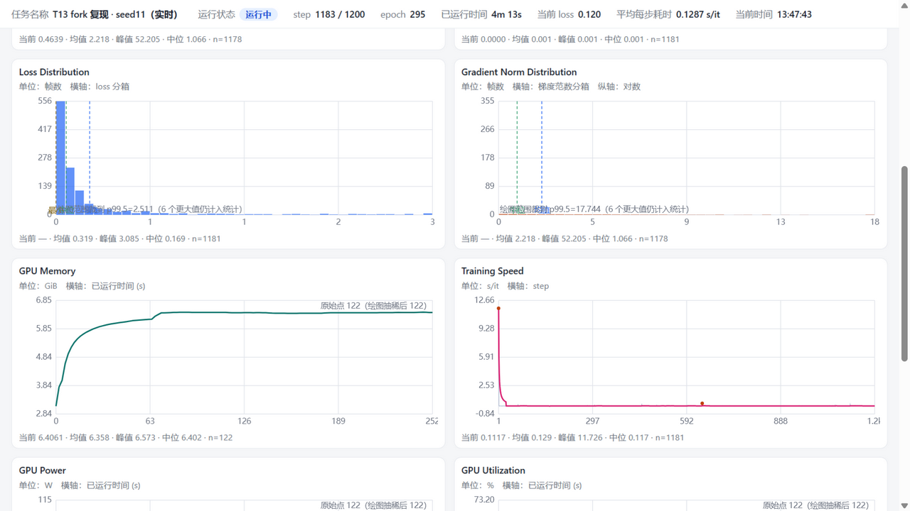
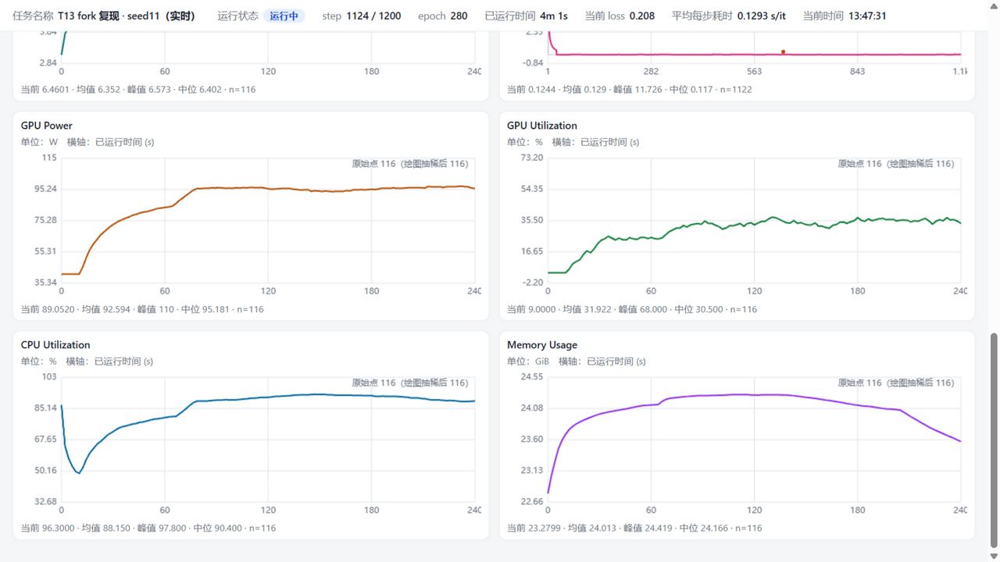

# 训练过程可视化（T14 阶段 C 可视化交付，2026-09-24）

按用户给的界面规格实现：浅色背景、**两列 × 六行 12 张图**、顶部状态栏随窗口自适应（窄屏单列）。
数据全部来自**本项目真实训练流程**，没有另做脱离项目的演示页。

## 1. 现有项目的训练入口、指标来源与前端结构（规格 §5.1）

| 环节 | 现状（本次改造前） | 本次接入方式 |
| --- | --- | --- |
| 训练入口 | `scripts/m5_train_seg.py`（SegUNet，AMP，`--init/--resume/--out/--seed`） | 新增 `--metrics-run/--task-name/--monitor-interval`；**不传时行为与以前完全一致** |
| 指标来源 | 每个 epoch 的 train loss / val acc / mIoU / line IoU（`train_hist.json` + `curve.png`） | 在优化步内新增逐 step 采集：loss、像素准确率、**梯度范数**（AMP 下先 `unscale_` 再按 float64 统计）、学习率、每步耗时 |
| 日志存储 | `logs/`（训练产物）、T14 的 `logs/experiments/<run_id>/events.jsonl`（epoch 级事件） | 新增 `logs/experiments/<run_id>/metrics.jsonl`（三类记录：task / train / system），与事件流并存 |
| 前端结构 | 只有 `scripts/m5_seg_dashboard.py` 渲染的**静态** HTML（训练结束后看） | 新增 `scripts/m5_train_monitor.py`：实时服务 + 离线快照，复用同一份模板 `beamng_autopilot/experiments/monitor_ui.py` |

## 2. 文件清单（规格 §5.2）

| 文件 | 作用 |
| --- | --- |
| `beamng_autopilot/experiments/metrics.py` | 指标存储（JSONL + 单调 `seq`）、系统采样器（GPU 显存/功耗/利用率、CPU、内存，默认 2 s）、统计（均值/中位/极值/p95，忽略非有限值并计数）、抽稀（只抽绘图点）、演示数据（带 `demo` 标记）、**非有限值消毒** |
| `beamng_autopilot/experiments/monitor_ui.py` | 自包含 HTML+CSS+原生 JS：状态栏、12 张 canvas 图、悬停提示、滚轮缩放/双击复位、窗口切换、可配置平滑、直方图整数频次轴 |
| `beamng_autopilot/experiments/monitor_server.py` | 只读 HTTP：`/`（页面）、`/metrics?since=<seq>`（增量）、`/state`、`/health`；仅绑 127.0.0.1 |
| `scripts/m5_train_monitor.py` | 薄入口：`serve` / `snapshot` / `demo` / `probe` / `status` |
| `scripts/m5_training_view.py` + 根目录 `启动训练看板.vbs` / `启动训练监控.vbs` / `启动训练台账.vbs` | 双击入口：自动挑最近一轮 → 渲染或起服务 → 开浏览器（台账不挑轮次）；VBS 只是壳，判断逻辑全在脚本里 |
| `scripts/m5_training_history.py` | 历史台账：扫全仓 `train_hist.json` + `decision_*.json` → 一张自包含 HTML（+ `--json`）；只列事实、不做排行，缺列写"缺列"不写 0，缺列原因按产物自报字段（`line_ignored_frames`） |
| `scripts/m5_train_seg.py` | 逐 step 指标、任务状态、硬件采样线程、**失败留痕**（`record_training_failure`） |
| `beamng_autopilot/config.py` | `BEAMNG_LOGS_DIR` 可重定向产物目录（测试/CI 用），默认行为不变 |
| `tests/test_train_monitor.py` | 18 例：存储/增量去重/半写行、统计与抽稀、采样不可用路径、界面契约、HTTP 端点、**真实小训练端到端**、失败留痕 |

## 3. 启动方法与配置项（规格 §5.4）

**双击入口**（仓库根目录，自动挑 `logs/experiments/` 下最新的一轮）：

- `启动训练看板.vbs`：渲染学习看板并打开浏览器（隐藏控制台，失败时弹退出码）；
- `启动训练监控.vbs`：起实时监控并打开浏览器（**可见控制台**，因为服务本身要
  一直跑——在那里读 URL、按 Ctrl+C 或关窗口停止；重复双击只会重开浏览器页）；
- `启动训练台账.vbs`：扫全仓训练产物出历史台账（不挑轮次；看不到 run 目录的
  写入，扫 ~300 个 run 约几秒）。

三者都只是 `scripts/m5_training_view.py` 的壳，判断逻辑（挑哪一轮、没数据怎么
报、端口冲突怎么办）都在那个脚本里，改行为改它，不用碰 VBS。

命令行等价写法：

```pwsh
# 0) 双击入口的等价命令（自动挑最新一轮；--run-id 可指定）
.venv\Scripts\python.exe scripts\m5_training_view.py dashboard
.venv\Scripts\python.exe scripts\m5_training_view.py monitor --port 8760
.venv\Scripts\python.exe scripts\m5_training_view.py history
.venv\Scripts\python.exe scripts\m5_training_view.py list

# 1) 边训练边看：训练侧写指标，监控侧起服务
.venv\Scripts\python.exe scripts\m5_train_seg.py `
    --runs logs\m5_seg\ident_probe_20260923\front_main --split tail --val-frac 0.2 `
    --epochs 300 --batch 4 --lr 1e-3 --seed 11 `
    --metrics-run t14_monitor_live --task-name "T13 fork 复现 · seed11" `
    --monitor-interval 2.0 --out logs\experiments\t14_monitor_live\candidate

.venv\Scripts\python.exe scripts\m5_train_monitor.py serve --run-id t14_monitor_live --port 8760
# 浏览器打开 http://127.0.0.1:8760/

# 2) 训练结束后回看（自包含 HTML，不需要服务）
.venv\Scripts\python.exe scripts\m5_train_monitor.py snapshot `
    --run-id t14_monitor_live --out logs\experiments\monitor_snapshot.html

# 3) 只联调界面（数据带 DEMO 标记，页面显式横幅提示，绝不冒充真实结果）
.venv\Scripts\python.exe scripts\m5_train_monitor.py demo --run-id demo1 --steps 400 `

# 4) 排查"为什么图是空的"
.venv\Scripts\python.exe scripts\m5_train_monitor.py probe      # 打印一次真实硬件采样
.venv\Scripts\python.exe scripts\m5_train_monitor.py status --run-id <run_id>
```

配置项：`--monitor-interval`（硬件采样周期，默认 2 s）、`--task-name`（状态栏任务名）、
`serve --port/--host/--poll-ms`（默认 8760 / 127.0.0.1 / 2000 ms）。
**改界面后必须重启 `serve`**：模板在进程启动时载入内存（本次踩过：重载页面仍是旧代码，白白多查一轮）。

## 4. 界面截图（规格 §5.4）

实时运行中（状态栏 8 项 + Loss/Accuracy/Gradient Norm/Learning Rate）：



直方图与硬件曲线（Loss/Gradient Norm Distribution 用**整数频次轴**，GPU Memory 按已运行时间）：



底部两行（GPU Power / GPU Utilization / CPU Utilization / Memory Usage，均带当前/峰值/均值/中位/n）：



截图文件：`logs/experiments/monitor_shot_{top,hist,bot}.png`（本机真实训练 `t14_monitor_live`，
20 帧小集 300 轮 / 1200 步，最终状态"已完成"）。截图方式：In-app browser 按视口分段截取
（`fullPage` 长页截图在本环境会出现内容平铺伪影，已记录）。

## 5. 验收结果（规格 §5.5）

| 验收项 | 结果 | 证据 |
| --- | --- | --- |
| 训练中曲线持续更新 | **通过** | 同一页面两次读数：`step 744/1200`→`step 1200/1200`、`当前 loss 0.180`→`0.119`；`/metrics?since=` 增量拉取 |
| 刷新后历史仍在 | **通过** | 页面对 `/metrics?since=0` 全量重拉；`metrics.jsonl` 1628 条记录，刷新后 12 张图全部恢复 |
| 训练结束后统计值正确 | **通过** | 结束后状态"已完成"，每图统计行 `均值/峰值/中位/n`（如 GPU Power 均值 92.6 W、峰值 110 W、n=125，基于**原始**记录） |
| 断线恢复不产生重复点 | **通过** | 按 `seq` 去重；`read_since` 单元测试断言同一 seq 不重复返回；页面 `state.bySeq` 去重 |
| 无数据指标有明确提示 | **通过** | 三类文案分开：`未采集到硬件数据`、`记录里该字段全为空（未采集或不适用）`、`没有有限值可统计`；设备不报功耗时显示"该设备未提供功耗数据"（测试断言）。**只有真实记录到的 0 才画 0**；统计量无数据时为 `None` + 原因 |
| 布局与参考图接近 | **通过** | 浅色、两列六行、顶部状态栏 8 项、每图有标题/单位/坐标轴/网格/图例；窄屏单列（`@media max-width:1100px`） |

其他规格项：悬停显示精确时间/step/数值（`hover()` 写 `#tip`）；缩放（滚轮 + 双击复位）；窗口切换（全部/最近 500/最近 100 步）；
平滑窗口可配（loss 默认 24、硬件默认 32，**原始曲线始终画在最底层，统计量基于原始值**）；
大 int64 数据抽稀（`绘图抽稀 1/N（原始 N 点全量保留，统计基于原始值）` 标注在图上）；
多设备可切换（`aggregate` 口径显式显示"mem/power = sum over devices, util = max over devices"）；
任务状态五态（等待中/运行中/已暂停/已完成/已失败），失败时保留图表并显示错误摘要。

## 6. 本轮发现并修掉的两个真缺陷（都由"让页面真的跑起来"暴露）

1. **非有限值破坏整条数据流**：梯度范数在 AMP 下溢出成 `inf`，而 `json.dumps` 默认写成裸 `Infinity`——
   **不是合法 JSON**，浏览器 `fetch().json()` 直接抛 `SyntaxError`，于是整页一条数据都读不到。
   修法：写入前递归消毒（非有限 → `null` + `non_finite_fields` 记名）、`allow_nan=False`、
   读取端也能救回旧文件（真实文件里那一条已按 `line 33: non-finite value in ['grad_norm'] -> null` 报出），
   并且梯度范数改为 float64 累计。
2. **直方图纵轴用了假轴对象**：`drawHist` 把没有 `sx/sy` 的普通对象传给 `drawMarker`，抛
   `TypeError: axis.sy is not a function`，**中断整个渲染循环** —— 表现是"硬件图显示未采集、直方图残留旧提示"，
   看起来像没数据。修法：传真实轴对象、直方图用整数频次轴、并在 `render()` 里给每张图单独 `try/catch`
   （一张图失败只在自己卡片上显示"该图渲染失败"，不再拖垮全页）。

## 7. 已知限制

- 硬件采样周期固定 2 s（可调），功耗/利用率依赖 `pynvml` 或 `nvidia-smi`；两者都不可用时按"未提供"显示而不是 0。
- 多设备汇总口径是"显存/功耗求和、利用率取最大"，界面已写明；单卡机器不显示设备切换。
- 实时通道是 HTTP 轮询（默认 2 s）+ `seq` 去重，不是 WebSocket：项目无前端推送依赖，轮询已满足"增量 + 去重 + 断线恢复"。
- 演示数据（`demo` 子命令）与真实数据在页面上有横幅区分，但 `metrics.jsonl` 里两者只差 `demo` 字段，混用需自查。
